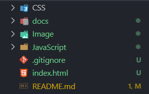
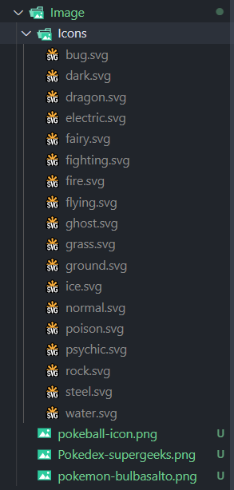
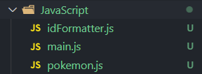
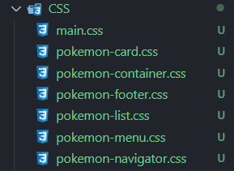

# Pokedex SG

## Objetivo

Esse Projeto vamos criar uma pokedex utilizando os conhecimentos que foram visto nas aulas anteriores e pegar informações externas da API (Application Program Interface) do  do [PokeApi](https://pokeapi.copokeApi).

## Linguagens de desenvolvimento

* __HTML5:__ Linguagen de marcação de texto, mantida pela [W3C](https://www.w3.org/) que serve para definir o conteudo da página da internet.
* __CSS3:__ Linguagem de programação de estilo em cascata, mantida pela [W3C](https://www.w3.org/) que serve para definir a parte visual da página da internet
* __JavaScript 2015:__ Linguagem de programação web, mantida pela [TC39](https://www.ecma-international.org/technical-committees/tc39/?tab=general), que serve para fazer a parte de interações da páginas web.

## Programas

* __VIsual Studio Code:__ Programa desenvolido pela Microsoft para editação de arquivos de programação das mais variadas linguagens existentes [Download do VS code](https://code.visualstudio.com/)
* __Figma:__ Plataforma que serve para fazer prototipação do site ante de codifica-los. Ajuda a planejar o visual e a funcionalidades do projeto que pretende desenvolver [Assece o site](https://www.figma.com/)
* __Adobe Color:__ Site desenvolvido pela Adobe, pque auxilia a criação de paheta de cores através das harmnias ou extraida de uma imagem [Acesse o site](https://color.adobe.com/)]

## Framework

* __Bootstrap 5:__ FrameWork CSS que ajuda a desenvolver páginas web, sem se preocupar com o CSS da página [Acesso o site](https://getbootstrap.com/)

## Icones

Os icones foram extraidos do site [Bootstrap Icons](https://icons.getbootstrap.com/), que traz uma ampla coleção de icones nos formatos PNG e SVG para colocar em nossas páginas. Abaixo teremos o svg das páginas que utilizaremos:

* Chevron Compact Left

```svg
<svg xmlns="http://www.w3.org/2000/svg" width="16" height="16" fill="currentColor" class="bi bi-chevron-compact-left" viewBox="0 0 16 16">
  <path fill-rule="evenodd" d="M9.224 1.553a.5.5 0 0 1 .223.67L6.56 8l2.888 5.776a.5.5 0 1 1-.894.448l-3-6a.5.5 0 0 1 0-.448l3-6a.5.5 0 0 1 .67-.223z"/>
</svg>
```

* Chevron compact Right

```svg
<svg xmlns="http://www.w3.org/2000/svg" width="16" height="16" fill="currentColor" class="bi bi-chevron-compact-right" viewBox="0 0 16 16">
  <path fill-rule="evenodd" d="M6.776 1.553a.5.5 0 0 1 .671.223l3 6a.5.5 0 0 1 0 .448l-3 6a.5.5 0 1 1-.894-.448L9.44 8 6.553 2.224a.5.5 0 0 1 .223-.671z"/>
</svg>
```

* Star

```svg
<svg xmlns="http://www.w3.org/2000/svg" width="16" height="16" fill="currentColor" class="bi bi-star" viewBox="0 0 16 16">
  <path d="M2.866 14.85c-.078.444.36.791.746.593l4.39-2.256 4.389 2.256c.386.198.824-.149.746-.592l-.83-4.73 3.522-3.356c.33-.314.16-.888-.282-.95l-4.898-.696L8.465.792a.513.513 0 0 0-.927 0L5.354 5.12l-4.898.696c-.441.062-.612.636-.283.95l3.523 3.356-.83 4.73zm4.905-2.767-3.686 1.894.694-3.957a.565.565 0 0 0-.163-.505L1.71 6.745l4.052-.576a.525.525 0 0 0 .393-.288L8 2.223l1.847 3.658a.525.525 0 0 0 .393.288l4.052.575-2.906 2.77a.565.565 0 0 0-.163.506l.694 3.957-3.686-1.894a.503.503 0 0 0-.461 0z"/>
</svg>
```

* Star fill

```svg
<svg xmlns="http://www.w3.org/2000/svg" width="16" height="16" fill="currentColor" class="bi bi-star-fill" viewBox="0 0 16 16">
  <path d="M3.612 15.443c-.386.198-.824-.149-.746-.592l.83-4.73L.173 6.765c-.329-.314-.158-.888.283-.95l4.898-.696L7.538.792c.197-.39.73-.39.927 0l2.184 4.327 4.898.696c.441.062.612.636.282.95l-3.522 3.356.83 4.73c.078.443-.36.79-.746.592L8 13.187l-4.389 2.256z"/>
</svg>
```

## Links dos arquivos estáticos do projeto

* Icones do tipos de pokemon [duiker101](https://github.com/duiker101/pokemon-type-svg-icons/releases/tag/1.0.0)
* imagem de referência utilizada para a palheta de cores dos tipos de pokemon [thelostlambda](https://thelostlambda.github.io/pokestats/)
* Imagem de referência utilizada para a palheta de cores do site [Pinterest - Vitor Mota](https://ar.pinterest.com/pin/536913586821056931/)
* Imagem da pokebola [pokemon go brasil](http://www.pokemongobrasil.com/wp-content/uploads/2016/08/pokebola-go.png)
* Imagem do bulbasalto [não sei a referência](https://pbs.twimg.com/media/Dl8nOCfXoAAt6E1.png)

## Definindo a estrutura do projeto

Antes de começara a programar nosso projeto, precisamos organizar os nossos arquivos em pasta, facilitando a manutenção e a responsábilidade de cada arquivo.

Então no Visual Studio Code vamos criar a Seguintes pastas:

* __CSS:__ Para colocar todas as folhas de estilo CSS
* __JavaScript:__ Para colocar os arquivos JavaScript de nossa página
* __Image:__ Para colocar as imagens e ícones de nossa página

Na raiz do projeto vamos criar o arquivo _index.html_ para fazer a estrutura da página.

> Vale lembrar que o nome _index_ no arquivo da criado serve para que o servidor reconheça que ele é o nosso arquivo inicial do nosso projeto

Você deve colocar p seguinte template na página:

```html
<!DOCTYPE html>
<html lang="pt-br">
<head>
  <meta charset="UTF-8">
  <title>pokedex</title>
  <link href="https://cdn.jsdelivr.net/npm/bootstrap@5.0.1/dist/css/bootstrap.min.css" rel="stylesheet" integrity="sha384-+0n0xVW2eSR5OomGNYDnhzAbDsOXxcvSN1TPprVMTNDbiYZCxYbOOl7+AMvyTG2x" crossorigin="anonymous">
  <!-- Links das referências das folhas de estilos do css -->
</head>
<body>
  <!-- Esdtrutura da página -->
  <script src="https://cdn.jsdelivr.net/npm/bootstrap@5.0.1/dist/js/bootstrap.bundle.min.js" integrity="sha384-gtEjrD/SeCtmISkJkNUaaKMoLD0//ElJ19smozuHV6z3Iehds+3Ulb9Bn9Plx0x4" crossorigin="anonymous"></script>
  <!-- Referências de scripts da página -->
</body>
</html>
```

No final você deverá ver essa estrutura em seu projeto



Depois você baixa os ícones dos tipos de pokemons e coloque eles na pasta __Image__, Certifique que a pasta de icones esteja com o nome icones, caso não esteja é só renomear. Ainda na pasta images coloque as imagens da pokebola e do balbasalto na pasta imagens.

E você verá a seguinte estrutura:



Na pasta javaScript vamos criar três arquivos:

* __idFormatter.js__ para fazer o tratamento do id do pokemon
* __main.js__ para fazer as interações na página
* __pokemon.js__ para criar o modelo do pokemon

No final ficará assim:



Na pasta CSS vamos criar alguns arquivos para a formatação da página

* __main.css__ responsável por fazer as configurações globais da página
* __pokemon-card.css__ Responsável por fazer a formatação do card pokemon
* __pokemon-container.css__ Responsável pelo posicionamento dos elementos aside e card
* __pokemon-footer.css__ Responsável pelo footer do aside
* __pokemon-list.css__ Responsável pela listagem dos pokemons
* __pokemon-menu.css__ Responsável pelo menu do aside
* __pokemon-navigation.css__ Responsável pela navegação da lista

No final ficara assim:



E pronto nossa estrutura já está pronta.

## Pontos finais

agora em diante você poderá navegar nos arquivos deste repositório e ir esquecendo todo o conteudo da página